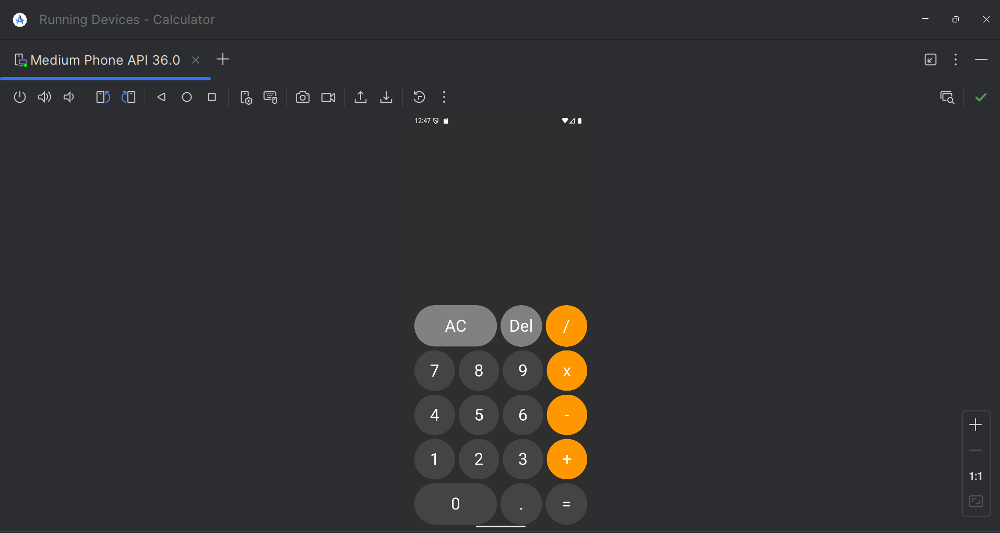
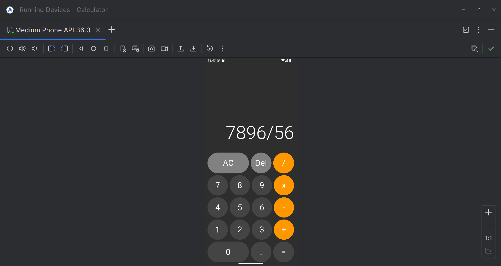
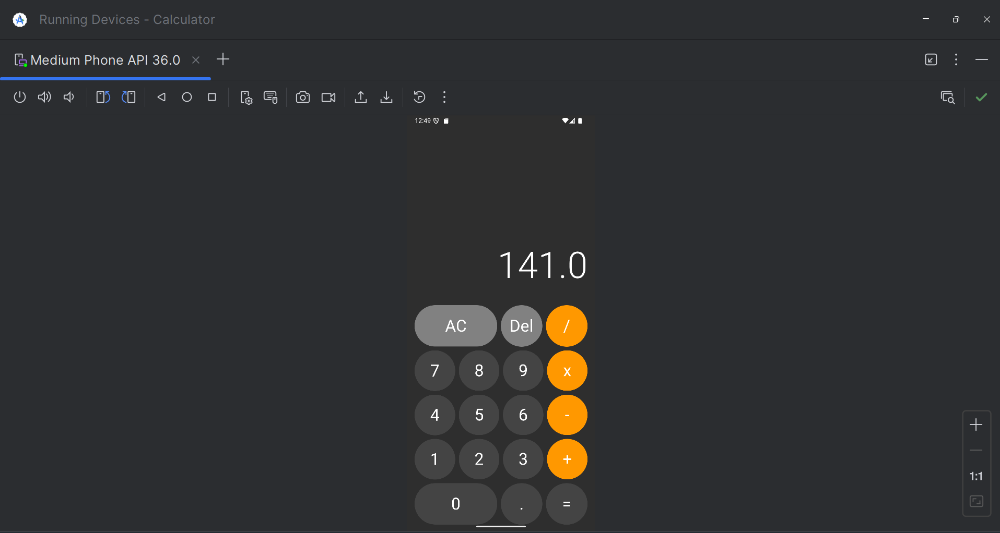

# 🧮 Calculator App

## 📖 Description

A simple Android Calculator application developed using Kotlin and XML. It performs basic arithmetic operations with a clean and user-friendly interface.

---

## ✨ Features

- Addition
- Subtraction
- Multiplication
- Division
- Input Validation
- Simple and Responsive UI

---

## 🛠 Tech Stack

- Kotlin
- XML
- Android Studio
- Material Design Components

---

## 📸 Screenshots

### Home Screen

### Calculation

### Result

---

## 🚀 How to Run

1. Clone this repository.
2. Open the project in Android Studio.
3. Sync Gradle.
4. Run the application on an emulator or Android device.

---

## 👩‍💻 Developed By

**Vaishnavi Lamba**
