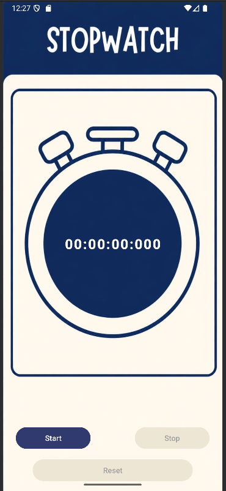
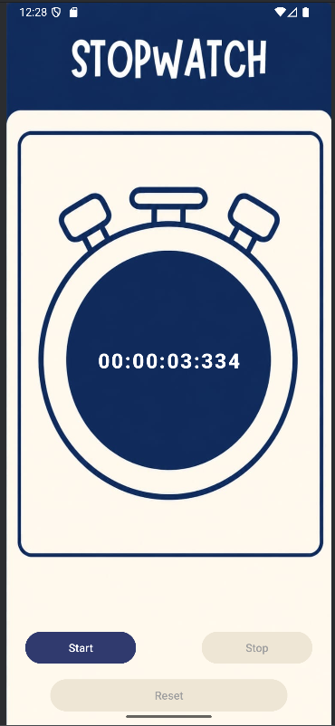
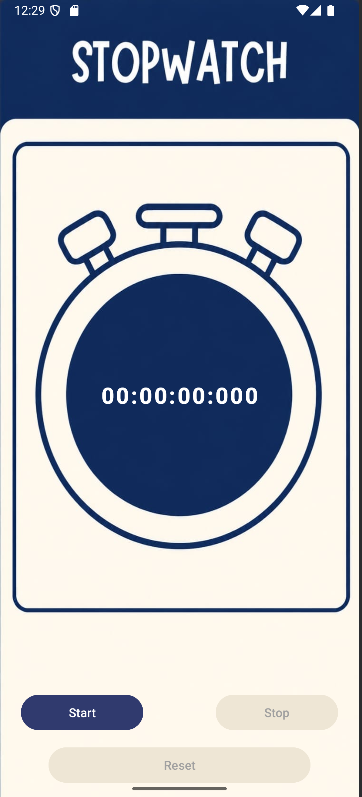

# Stopwatch App

## 📖 Description

A simple Android Stopwatch application built using Kotlin and XML.

---

## ✨ Features

- Start Timer
- Pause Timer
- Reset Timer
- Millisecond Support
- Clean UI

---

## 🛠 Tech Stack

- Kotlin
- XML
- Android Studio

## 📸 Screenshots

### Home Screen

### Timer Running

### Timer Reset

---

## 👩‍💻 Developed By

Vaishnavi Lamba
